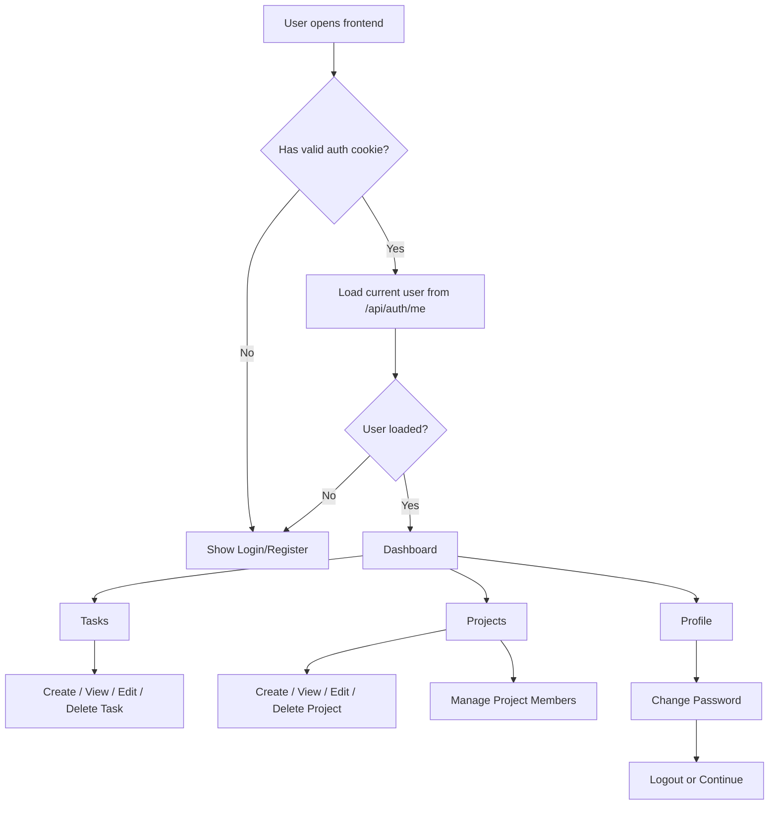
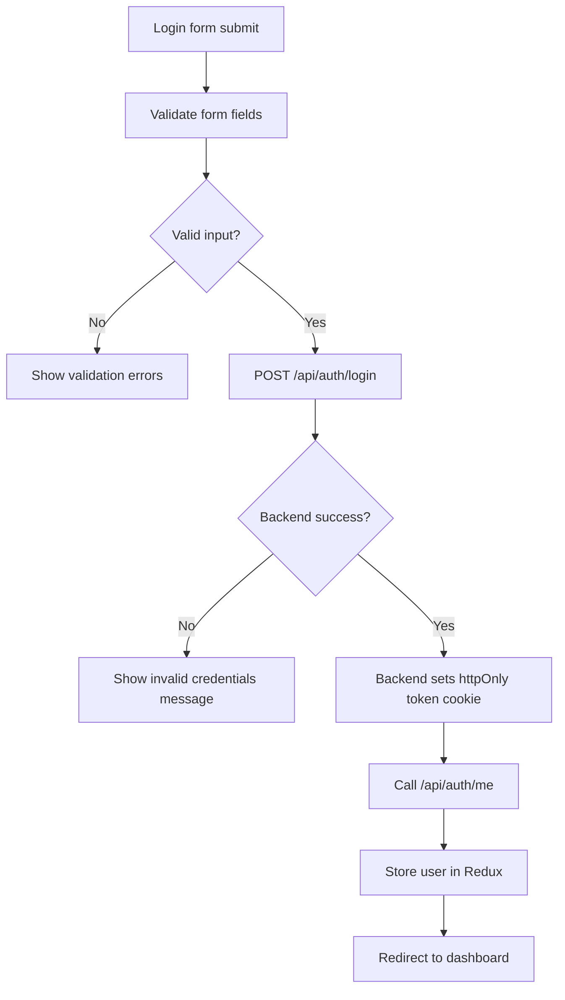
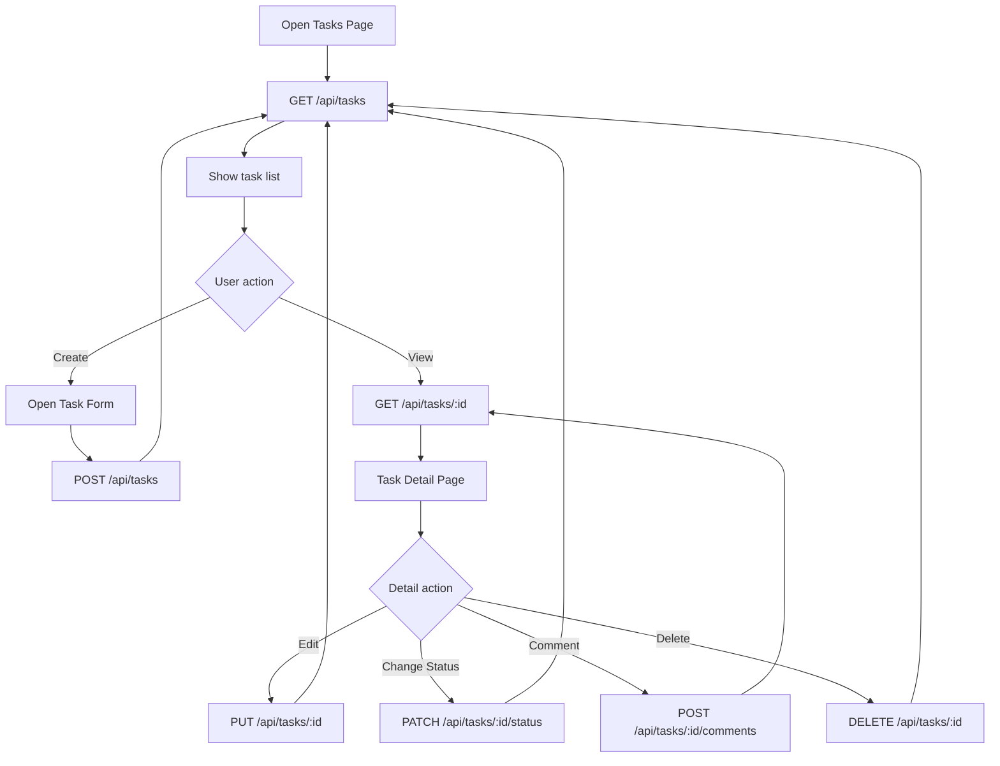
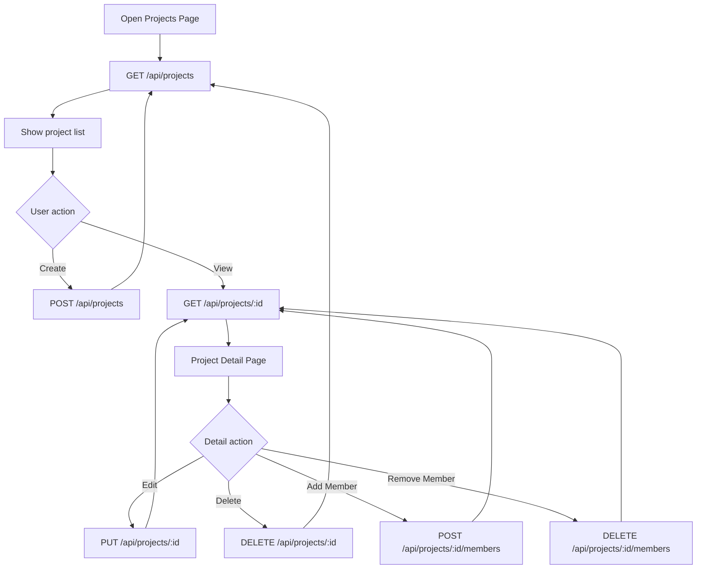
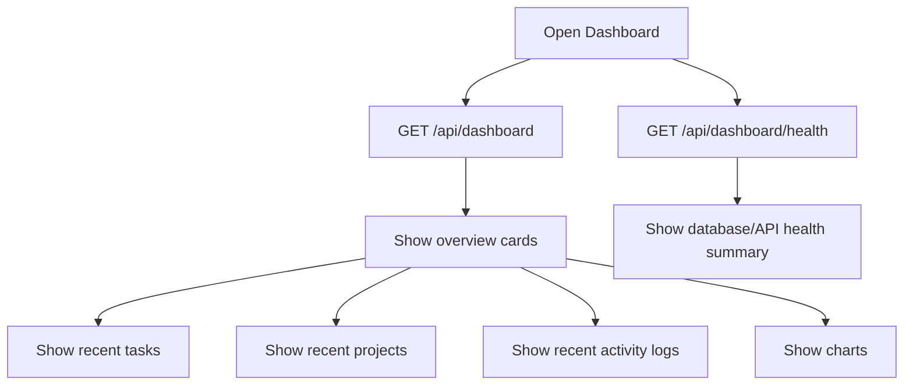

# Frontend Development Plan

Date: 2026-07-07

Project: Task Management System Frontend

Framework: Next.js, React, TypeScript, Tailwind CSS, Redux Toolkit, Axios, React Hook Form, Zod, Recharts

## Goal

Build a complete frontend for the existing backend API. The frontend should support authentication, dashboard overview, task management, project management, profile actions, and clear protected-route behavior.

This file is only a planning document. It does not include implementation code.

## Current Frontend Status

The frontend already has a Next.js app with:

- App Router structure
- Login and register pages
- Dashboard page placeholder
- Redux store setup
- Auth API service files
- Tailwind CSS configured
- Axios installed
- Recharts installed
- React Hook Form and Zod installed

Current important files:

```text
frontend/
  src/
    app/
      layout.tsx
      page.tsx
      providers.tsx
      globals.css
      (auth)/
        login/page.tsx
        register/page.tsx
      dashboard/
        layout.tsx
        page.tsx
    components/
      auth/
        LoginForm.tsx
        RegisterForm.tsx
    lib/
      store.ts
    services/
      api.ts
      authApi.ts
    stores/
      authSlice.ts
```

## Recommended Final Folder Structure

```text
frontend/
  public/
    icons/
    images/

  src/
    app/
      layout.tsx
      page.tsx
      providers.tsx
      globals.css

      (auth)/
        layout.tsx
        login/
          page.tsx
        register/
          page.tsx
        forgot-password/
          page.tsx

      dashboard/
        layout.tsx
        page.tsx

      tasks/
        page.tsx
        new/
          page.tsx
        [id]/
          page.tsx
          edit/
            page.tsx

      projects/
        page.tsx
        new/
          page.tsx
        [id]/
          page.tsx
          edit/
            page.tsx
          members/
            page.tsx

      profile/
        page.tsx
        change-password/
          page.tsx

      settings/
        page.tsx

      not-found.tsx

    components/
      auth/
        LoginForm.tsx
        RegisterForm.tsx
        AuthCard.tsx

      dashboard/
        DashboardStats.tsx
        RecentTasks.tsx
        RecentProjects.tsx
        ActivityFeed.tsx
        StatusChart.tsx

      tasks/
        TaskList.tsx
        TaskCard.tsx
        TaskTable.tsx
        TaskForm.tsx
        TaskFilters.tsx
        TaskStatusBadge.tsx
        TaskPriorityBadge.tsx
        TaskComments.tsx

      projects/
        ProjectList.tsx
        ProjectCard.tsx
        ProjectForm.tsx
        ProjectMembers.tsx
        ProjectStatusBadge.tsx

      layout/
        AppSidebar.tsx
        AppHeader.tsx
        MobileNav.tsx
        UserMenu.tsx
        ProtectedLayout.tsx

      common/
        Button.tsx
        Input.tsx
        Select.tsx
        Textarea.tsx
        Modal.tsx
        EmptyState.tsx
        LoadingState.tsx
        ErrorState.tsx
        ConfirmDialog.tsx
        Pagination.tsx

    features/
      auth/
        authSlice.ts
        authApi.ts
        authTypes.ts

      tasks/
        taskApi.ts
        taskSlice.ts
        taskTypes.ts
        taskConstants.ts

      projects/
        projectApi.ts
        projectSlice.ts
        projectTypes.ts
        projectConstants.ts

      dashboard/
        dashboardApi.ts
        dashboardTypes.ts

    hooks/
      useAuth.ts
      useDebounce.ts
      usePagination.ts
      useProtectedRoute.ts

    lib/
      store.ts
      axios.ts
      constants.ts
      utils.ts
      validations.ts

    services/
      api.ts

    styles/
      theme.css

    types/
      api.ts
      auth.ts
      task.ts
      project.ts
      dashboard.ts
```

## Main App Flow Chart



## Authentication Flow Chart



## Task Flow Chart



## Project Flow Chart



## Dashboard Flow Chart



## Page Plan

### Public Pages

- Login page
- Register page
- Forgot password page, optional for now

### Protected Pages

- Dashboard
- Tasks list
- Create task
- Task detail
- Edit task
- Projects list
- Create project
- Project detail
- Edit project
- Project members
- Profile
- Change password
- Settings

## Component Plan

### Layout Components

- Sidebar with navigation links
- Header with search/user menu
- Mobile navigation
- Protected layout wrapper
- Page title/header component

### Auth Components

- Login form
- Register form
- Auth card wrapper
- Auth error alert

### Task Components

- Task list
- Task table
- Task card
- Task form
- Task filters
- Status badge
- Priority badge
- Comment list
- Comment form
- Delete confirmation modal

### Project Components

- Project list
- Project card
- Project form
- Project member list
- Add member modal
- Project status badge

### Dashboard Components

- Stats cards
- Task status chart
- Recent task list
- Recent project list
- Recent activity feed
- System health panel

### Common Components

- Button
- Input
- Select
- Textarea
- Modal
- Confirm dialog
- Empty state
- Loading state
- Error state
- Pagination

## State Management Plan

Use Redux Toolkit for global state that is needed across pages.

Recommended global state:

- Auth user
- Auth loading status
- Auth error
- Optional dashboard summary cache
- Optional UI state such as sidebar collapsed/open

Use local component state for:

- Form fields
- Modal open/close state
- Temporary filters before submit
- Password visibility toggles

Use API service layer for:

- Auth API calls
- Task API calls
- Project API calls
- Dashboard API calls

## API Integration Plan

Backend base URL:

```text
NEXT_PUBLIC_API_URL=http://localhost:5000/api
```

Important frontend API behavior:

- All requests must include credentials because auth uses an HTTP-only cookie.
- On app load, call `/auth/me` to check if the user is logged in.
- On logout, call `/auth/logout`, then clear frontend auth state.
- On 401 responses, redirect user to `/login`.
- On successful login/register, navigate to `/dashboard`.

## Development Order

### Phase 1: Foundation

1. Confirm Tailwind CSS works globally.
2. Confirm Redux provider is connected.
3. Create shared Axios/API client.
4. Configure API client to send cookies.
5. Create protected route behavior.
6. Create app shell: sidebar, header, main content area.

### Phase 2: Authentication

1. Finish login form integration.
2. Finish register form integration.
3. Add `/auth/me` check on app load.
4. Add logout flow.
5. Add change-password page.
6. Add redirect rules for logged-in and logged-out users.

### Phase 3: Dashboard

1. Connect dashboard page to `/api/dashboard`.
2. Add stats cards.
3. Add task status chart.
4. Add recent tasks.
5. Add recent projects.
6. Add activity feed.
7. Add system health panel from `/api/dashboard/health`.

### Phase 4: Tasks

1. Create task list page.
2. Add filters for status, priority, tags, project, due date.
3. Add create task page/form.
4. Add task detail page.
5. Add edit task page/form.
6. Add status update action.
7. Add comments UI.
8. Add delete task confirmation.

### Phase 5: Projects

1. Create project list page.
2. Add create project page/form.
3. Add project detail page.
4. Add edit project page/form.
5. Add member management page.
6. Add delete project confirmation.

### Phase 6: Polish

1. Add loading states for every API call.
2. Add empty states for lists.
3. Add error states and retry buttons.
4. Add toast notifications.
5. Add responsive mobile layout.
6. Add form validation with Zod.
7. Add final UI consistency pass.

### Phase 7: Testing and Verification

1. Test login and cookie storage.
2. Test refresh after login stays authenticated.
3. Test protected pages redirect when logged out.
4. Test task CRUD.
5. Test project CRUD.
6. Test project member actions.
7. Test dashboard data.
8. Test logout.
9. Test mobile screen sizes.
10. Run production build.

## Important Backend Notes Before Frontend Work

The backend analysis found a few issues that affect frontend behavior:

- Auth uses HTTP-only cookie, so frontend cannot read the token directly.
- API requests must include credentials.
- `/auth/refresh-token` may need backend cookie parsing fixed.
- User role may not be included in JWT yet, so admin dashboard behavior may not work correctly.
- Registration currently accepts role from client; this should be fixed backend-side before production.
- Redis cache keys should be scoped by user before testing multi-user scenarios.

## Recommended First Frontend Tasks

1. Finish the shared API client.
2. Make login work with cookies.
3. Add `/auth/me` based session check.
4. Build protected dashboard layout.
5. Build dashboard page.
6. Build tasks page.
7. Build projects page.

## Final Target User Journey

```text
User opens app
  -> sees login/register
  -> logs in
  -> reaches dashboard
  -> sees task/project summary
  -> creates project
  -> creates task inside project
  -> updates task status
  -> adds comments
  -> checks activity/dashboard
  -> logs out
```

## Success Checklist

- Login works.
- HTTP-only cookie is saved.
- Refreshing page keeps user logged in.
- Logout clears session.
- Dashboard loads real backend data.
- Task list loads real backend data.
- Task create/update/delete works.
- Project list loads real backend data.
- Project create/update/delete works.
- Project members can be managed.
- Forms validate before API calls.
- Mobile layout is usable.
- Production build passes.

