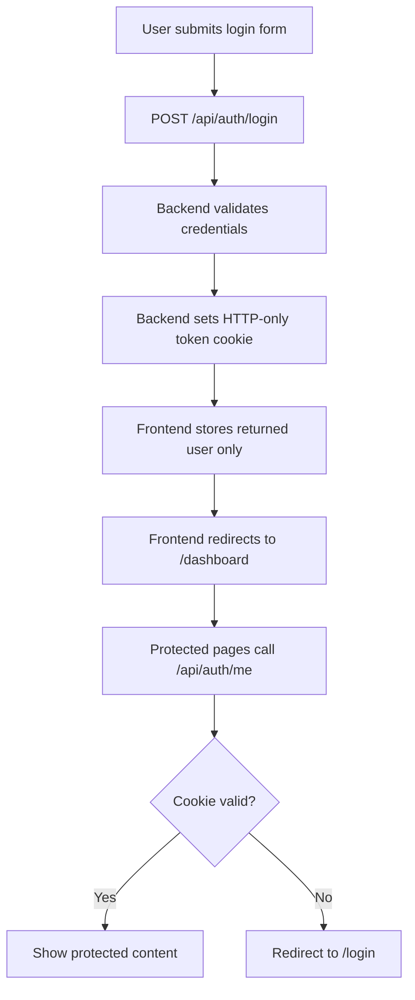

# Frontend Issues Report

Date: 2026-07-08

Project: Task Management System Frontend

## Summary

The frontend has a good Next.js structure and many planned pages/components are present, but it currently has several issues that will break build, navigation, authentication state, and data rendering.

Most important problems:

1. Production build fails.
2. Dashboard links point to wrong routes.
3. Frontend API response expectations do not match backend responses.
4. Auth logic still expects a JWT token in JSON/localStorage, but backend uses HTTP-only cookies.
5. Shared TypeScript type files are empty, causing many `any` usages and lint errors.

## Verification Results

### Build

Command:

```bash
npm.cmd run build
```

Result: fails.

Main error:

```text
File 'src/app/(auth)/forgot-password/page.tsx' is not a module.
```

Cause:

```text
src/app/(auth)/forgot-password/page.tsx
```

is empty and does not export a Next.js page component.

### Lint

Command:

```bash
npm.cmd run lint
```

Result: fails.

Summary:

```text
54 problems
46 errors
8 warnings
```

Main lint categories:

- `no-explicit-any`
- `no-unused-vars`
- `react/no-unescaped-entities`

## Critical Issues

### 1. Empty Forgot Password Page Breaks Build

File:

```text
src/app/(auth)/forgot-password/page.tsx
```

Problem:

The file exists but is empty. In Next.js App Router, every `page.tsx` must export a valid page component.

Impact:

- Production build fails.
- App cannot be deployed.
- `/forgot-password` route is broken.

Recommended fix:

Add a real page component or remove the route and remove links to it.

## High-Priority Issues

### 2. Frontend Route Links Do Not Match Actual App Routes

Actual route structure:

```text
/dashboard
/dashboard/tasks
/dashboard/tasks/new
/dashboard/tasks/[id]
/dashboard/tasks/[id]/edit
/dashboard/projects
/dashboard/projects/new
/dashboard/projects/[id]
/dashboard/projects/[id]/edit
/dashboard/profile
/dashboard/profile/change-password
```

But many links and redirects use:

```text
/tasks
/tasks/new
/tasks/[id]
/projects
/projects/new
/projects/[id]
/profile
/settings
```

Examples:

```text
src/components/layout/ProtectedLayout.tsx
src/app/dashboard/tasks/page.tsx
src/app/dashboard/tasks/[id]/page.tsx
src/app/dashboard/projects/page.tsx
src/app/dashboard/projects/[id]/page.tsx
src/components/tasks/TaskForm.tsx
src/components/projects/ProjectForm.tsx
src/app/dashboard/profile/page.tsx
src/app/dashboard/profile/change-password/page.tsx
```

Impact:

- Sidebar navigation goes to non-existing pages.
- Task/project detail links can 404.
- Form submit redirects can go to wrong routes.
- Profile change-password flow redirects incorrectly.

Recommended fix:

Use dashboard-prefixed paths consistently:

```text
/dashboard/tasks
/dashboard/tasks/new
/dashboard/tasks/:id
/dashboard/tasks/:id/edit
/dashboard/projects
/dashboard/projects/new
/dashboard/projects/:id
/dashboard/projects/:id/edit
/dashboard/profile
/dashboard/profile/change-password
```

### 3. API Response Shape Mismatch

The frontend expects many API responses to use:

```ts
data.data
```

But backend responses are not consistent.

Examples:

Tasks list backend returns:

```json
{
  "tasks": [],
  "pagination": {}
}
```

Frontend correctly reads:

```ts
const tasks = data?.tasks || [];
```

But task detail page reads:

```ts
const task = data?.data;
```

Backend task detail returns the task directly:

```json
{
  "_id": "...",
  "title": "..."
}
```

Projects list backend returns an array directly:

```json
[
  {
    "_id": "...",
    "name": "..."
  }
]
```

Frontend reads:

```ts
const projects = data?.data || [];
```

Affected files:

```text
src/app/dashboard/tasks/[id]/page.tsx
src/app/dashboard/tasks/[id]/edit/page.tsx
src/app/dashboard/projects/page.tsx
src/app/dashboard/projects/[id]/page.tsx
src/app/dashboard/projects/[id]/edit/page.tsx
src/services/projectApi.ts
src/services/taskApi.ts
```

Impact:

- Detail pages may show "not found" even when data exists.
- Project list may appear empty even when backend returns projects.
- Edit pages may fail to populate forms.

Recommended fix:

Pick one API response convention.

Option A: Update backend to always return:

```json
{
  "success": true,
  "data": ...
}
```

Option B: Update frontend to match the backend's current response shape.

For frontend-only fix, normalize responses in RTK Query using `transformResponse`.

### 4. Auth Token Logic Does Not Match HTTP-Only Cookie Auth

Backend login sets JWT in an HTTP-only cookie:

```text
Set-Cookie: token=...
```

The backend does not return token in response JSON.

But frontend login expects:

```ts
data.data.token
```

and stores it in Redux/localStorage.

Affected files:

```text
src/services/authApi.ts
src/stores/authSlice.ts
src/services/api.ts
```

Current frontend logic:

```ts
if (data?.data?.user && data?.data?.token) {
  dispatch(setCredentials({
    user: data.data.user,
    token: data.data.token,
  }));
}
```

Problem:

Since `data.data.token` does not exist, Redux auth state may not update after login.

Also, HTTP-only cookies cannot be read by JavaScript, so storing token in localStorage is not appropriate for this auth model.

Impact:

- Login may redirect, but Redux says user is not authenticated.
- Authorization header is unnecessary or empty.
- `localStorage` token handling is dead or misleading code.

Recommended fix:

- Remove token from Redux state.
- Remove localStorage token usage.
- Rely on cookie auth with `credentials: 'include'`.
- After login, call `/auth/me` or use returned `user` to set auth user.

Expected flow:

```text
POST /auth/login
  backend sets HTTP-only cookie
  frontend stores user only
  protected requests send cookie automatically
```

### 5. `src/types` Files Are Empty

Current empty files:

```text
src/types/api.ts
src/types/auth.ts
src/types/dashboard.ts
src/types/project.ts
src/types/task.ts
```

Impact:

- Services and components use `any`.
- Lint fails heavily.
- API response handling is fragile.
- Form props and page data are not type-safe.

Recommended fix:

Define shared types for:

- `ApiResponse<T>`
- `User`
- `LoginResponse`
- `RegisterRequest`
- `Task`
- `TaskStatus`
- `TaskPriority`
- `Project`
- `ProjectStatus`
- `ProjectMember`
- `DashboardData`

Then replace `any` in service files and components.

## Medium-Priority Issues

### 6. Duplicate/Empty Feature Structure

There are two parallel API organization patterns:

```text
src/services/*.ts
src/features/*/*.ts
```

But most `src/features/*` files are empty:

```text
src/features/auth/authApi.ts
src/features/auth/authSlice.ts
src/features/auth/authTypes.ts
src/features/tasks/taskApi.ts
src/features/tasks/taskSlice.ts
src/features/tasks/taskTypes.ts
src/features/projects/projectApi.ts
src/features/projects/projectSlice.ts
src/features/projects/projectTypes.ts
src/features/dashboard/dashboardApi.ts
src/features/dashboard/dashboardTypes.ts
```

Impact:

- Developers may import from the wrong path.
- Project structure looks more complete than it really is.
- Maintenance becomes confusing.

Recommended fix:

Choose one structure.

Option A:

Keep `src/services/*` and delete empty `src/features/*`.

Option B:

Move API/slice/types into `src/features/*` and delete duplicate service files.

### 7. `src/lib/axios.ts` Is Empty

Axios is installed and `src/lib/axios.ts` exists, but it is empty.

Current real API layer uses RTK Query with `fetchBaseQuery`.

Impact:

- Unclear whether project should use Axios or RTK Query.
- Empty file adds confusion.

Recommended fix:

If RTK Query is the chosen approach, remove Axios setup file and possibly remove Axios dependency.

If Axios is preferred, implement one shared Axios client and stop using RTK Query.

### 8. Delete Buttons Are Not Fully Implemented

Some list pages delete items, but detail pages still contain placeholder comments.

Examples:

```text
src/app/dashboard/tasks/[id]/page.tsx
src/app/dashboard/projects/[id]/page.tsx
```

Problem:

Delete button click contains:

```ts
// Delete logic here
```

Impact:

- User can see delete button but action does nothing.

Recommended fix:

Wire detail delete buttons to existing RTK Query delete mutations and redirect back to list page.

### 9. Search Filter Is Sent But Backend Does Not Support It

Tasks page includes:

```ts
search: ''
```

and sends it to:

```ts
useGetTasksQuery(filters)
```

Backend task filters currently support:

```text
status
priority
tags
projectId
dueDateBefore
dueDateAfter
page
limit
```

It does not support `search`.

Impact:

- Search box may appear to work visually but does not actually search backend results.

Recommended fix:

Either:

- Add search support to backend, or
- Perform client-side filtering on loaded tasks, or
- Remove search until backend supports it.

### 10. Pagination Buttons Do Not Change Page

Tasks page shows Previous/Next buttons, but they do not update the page query/filter.

Impact:

- Pagination UI appears but is non-functional.

Recommended fix:

Track `page` in filters and update it from pagination buttons.

### 11. Dashboard Fetches Stats But Does Not Use It

Dashboard page calls:

```ts
useGetTaskStatsQuery()
```

and assigns:

```ts
const statsData = stats?.data;
```

But `statsData` is unused.

Impact:

- Extra API request.
- Lint warning.

Recommended fix:

Either use stats for charts/cards or remove the request.

## Lint Issues To Fix

Main lint categories:

### `no-explicit-any`

Many files use `any`, especially:

```text
src/services/authApi.ts
src/services/taskApi.ts
src/services/projectApi.ts
src/services/dashboardApi.ts
src/components/tasks/TaskForm.tsx
src/components/projects/ProjectForm.tsx
src/app/dashboard/tasks/page.tsx
src/app/dashboard/projects/page.tsx
```

Fix by filling `src/types/*` and using those types.

### `react/no-unescaped-entities`

Examples:

```text
Don't
you're
doesn't
Here's
```

Fix by replacing apostrophes with:

```text
&apos;
```

or using string expressions.

### `no-unused-vars`

Examples:

```text
statsData
router
Calendar
Plus
setValue
watch
```

Fix by removing unused imports/variables or using them.

## Recommended Fix Order

1. Add a valid component to `forgot-password/page.tsx` or remove that route.
2. Fix all dashboard route links and redirects.
3. Decide API response format and normalize frontend services.
4. Fix auth state to use HTTP-only cookie model.
5. Fill shared TypeScript type files.
6. Replace `any` with real types.
7. Remove empty duplicate `features/*` files or move service logic into them.
8. Wire detail page delete actions.
9. Fix search and pagination behavior.
10. Run build and lint again.

## Target Auth Flow



## Target Dashboard Route Structure

```mermaid
flowchart TD
  A[/dashboard] --> B[/dashboard/tasks]
  A --> C[/dashboard/projects]
  A --> D[/dashboard/profile]
  B --> E[/dashboard/tasks/new]
  B --> F[/dashboard/tasks/:id]
  F --> G[/dashboard/tasks/:id/edit]
  C --> H[/dashboard/projects/new]
  C --> I[/dashboard/projects/:id]
  I --> J[/dashboard/projects/:id/edit]
  D --> K[/dashboard/profile/change-password]
```

## Final Checklist

- `npm.cmd run build` passes.
- `npm.cmd run lint` passes.
- Login stores cookie and redirects correctly.
- Refreshing dashboard keeps user logged in.
- Sidebar links do not 404.
- Task list loads from backend.
- Task detail page loads from backend.
- Task create/edit redirects to correct dashboard route.
- Project list loads from backend.
- Project detail page loads from backend.
- Project create/edit redirects to correct dashboard route.
- Logout clears session and redirects to login.

